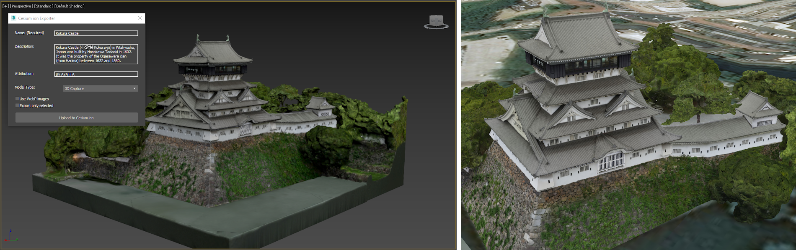
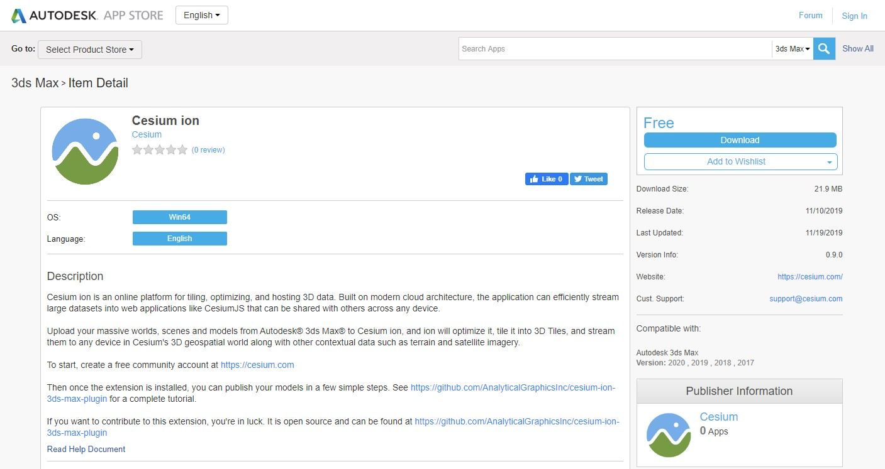
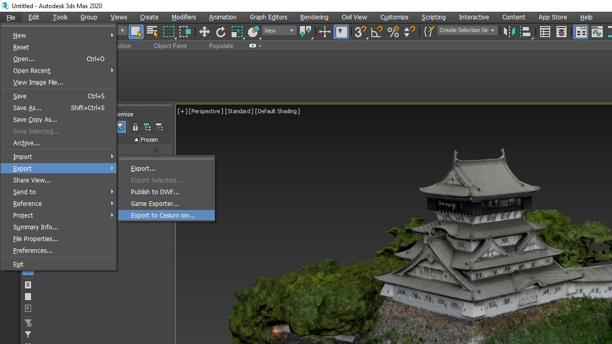
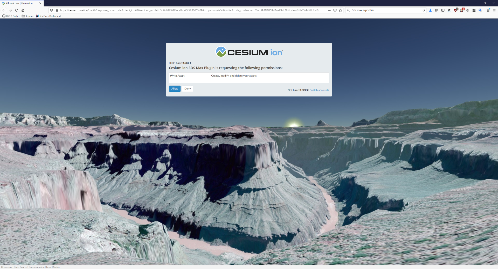
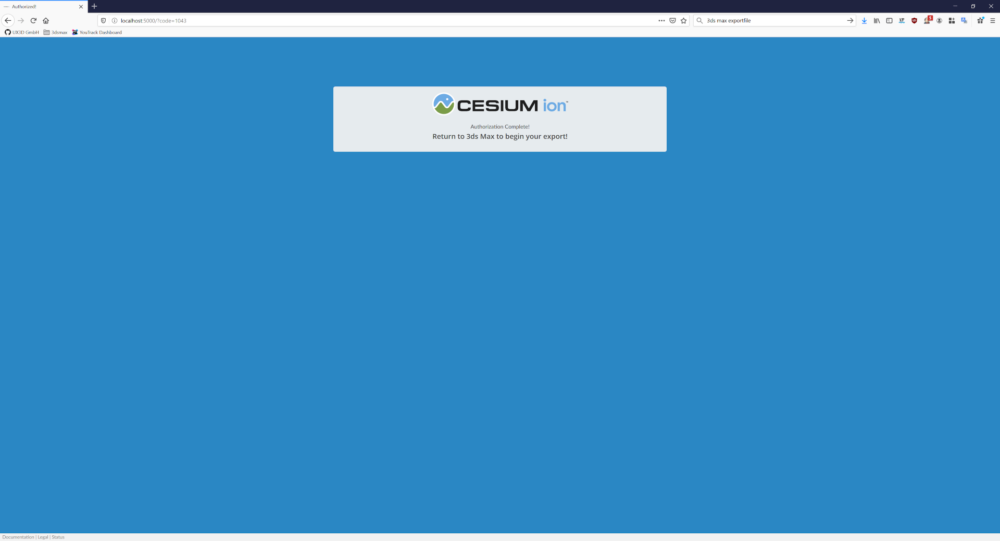
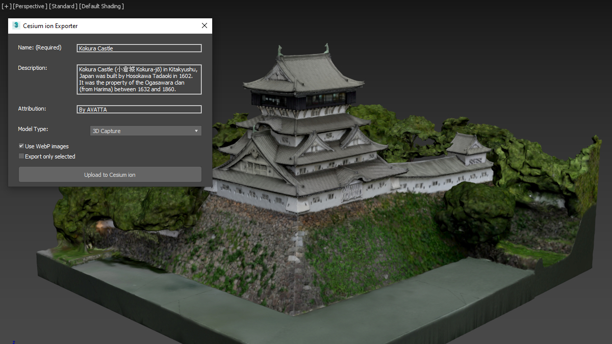
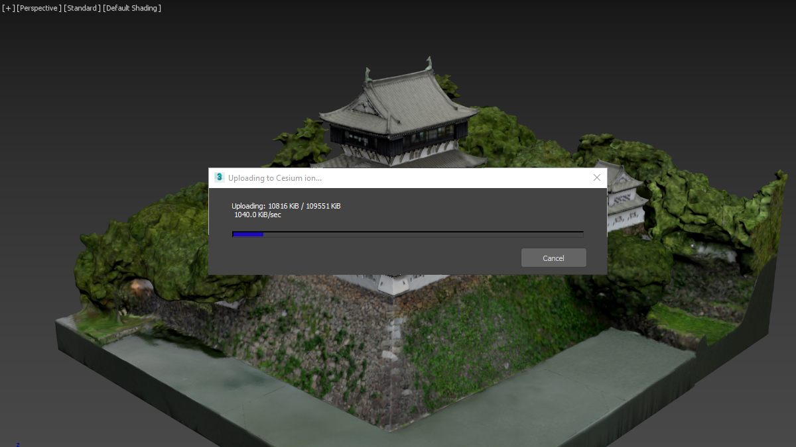

  

# Cesium ion 3ds Max Plugin

The Cesium ion 3ds Max plugin enables you to effortlessly export your models to your Cesium ion account and stream 3D Tiles to CesiumJS and other applications.

Leveraging Cesium ion and the power of 3D Tiles, even multi-gigabyte models can be streamed to any device without having to download the entire tileset up front. By visualizing 3D Tiles with CesiumJS, you can fuse your models with other datasets, add geospatial context to place it at a real world location, or overlay additional details and analysis.

Learn more at https://cesium.com.

    Kokura Castle (left) loaded into 3ds Max and (right) fused with Cesium World Terrain and imagery in CesiumJS after being tiled with ion.

## Installation and Usage

The plugin can be installed by downloading and running the installer from the Autodesk App Store.

[Cesium ion 3ds Max plugin on Autodesk App Store](https://apps.autodesk.com/3DSMAX/en/Detail/Index?id=3653390948844719757&appLang=en&os=Win64)

For development, see [Developer Guide](./Documentation/DeveloperGuide/README.md)

## Tutorial

3ds Max starts with an empty scene. You can load your own models at this time if you would like to export one of your own works.

To export your model to Cesium ion go to **File > Export > Export to Cesium ion...**.

The first time you use the plugin, you will need to authorize the plugin to access your Cesium ion account. The plugin automatically launches the browser page. You may be asked for your name and password. If you are already logged in, a permissions window similar to the one below will appear immediately.

Click Allow, and the next page will confirm that permission has been granted. You can close your browser window and return to 3ds Max.

The Cesium ion exporter window in 3ds Max will look like:

* **Name**: (Required) A name for the ion asset you are uploading.
* **Description**: An optional description.
* **Attribution**: Any attribution you would like to appear when this asset is loaded into client visualization engines.
* **Model Type**: (Required) A hint to ion about the type of model you are uploading. For most 3ds Max models, select **3D Model**. If you are loading a mesh that originated from a Reality Model, 3D scan, LIDAR, or photogrammetry processes, select **3D Capture / Reality Model / Photogrammetry** instead. To host a model on Cesium ion as glTF, without tiling it into 3D Tiles, choose **3D Model (convert to glTF)**.
* **Geometry Compression**:
Use one of the following geometry compression options to create a smaller tileset with better streaming performance.
  * **Draco Compression** - Draco is a type of geometry compression optimized for smaller file sizes. 3D Tiles produced with this option require a client, such as CesiumJS, that supports the `KHR_draco_mesh_compression` glTF extension.
  * **Meshopt Compression** - Meshopt geometry compression is optimized for runtime performance. 3D Tiles produced with this option require a client, such as CesiumJS, that supports the `EXT_meshopt_compression` glTF extension.
  * **None** - No geometry compression is applied.
* **KTX2 Texture Compression**: KTX v2.0 is an image container format that supports Basis Universal supercompression. Use KTX2 compression to create a smaller tileset with better streaming performance.  Disabling KTX2 extension results in a less optimized tileset but one that is compatible with clients that do not support KTX2. We recommend enabling KTX2 for your assets.
* **Export only selected**: If selected, only selected objects will be uploaded.

Next click **Upload to Cesium ion**

At this point a progress bar will appear and the model will be uploaded to Cesium ion.

When the upload is completed, 3ds Max will launch Cesium ion where you can view the asset in the ion dashboard.

**Congratulations!** You have successfully published your first 3ds Max model to Cesium ion!

### Note on Textures and Baking

Cesium ion requires all Autodesk materials to be baked to textures. If on Cesium ion the materials are not rendered correctly, you will need to bake the materials to textures in 3ds Max before exporting.

Follow the [Workflow: Texture Baking by Autodesk](https://knowledge.autodesk.com/support/3ds-max/learn-explore/caas/CloudHelp/cloudhelp/2020/ENU/3DSMax-Rendering/files/GUID-37414F9F-5E33-4B1C-A77F-547D0B6F511A-htm.html) guide from Autodesk to bake the materials to textures.

## Contributing

Interested in contributing? See [CONTRIBUTING.md](CONTRIBUTING.md). :heart:
